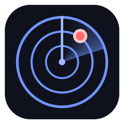

# Rip Radar

A Windows app that watches for sports card and Pokémon drops and pings your phone through Discord.

- **Topps release calendar**: every baseball, basketball and football product. Alerts when one is added, goes on pre-order or sale, moves date, and 15 minutes before a timed drop.
- **Pokémon Center**: alerts the moment the queue goes live, and when new 30th Celebration products load.
- **Raffles and drawings**: Walmart, Target, Dick's, Amazon, Best Buy, from news and Reddit, plus any product page you paste in.
- **Calendar**: every alert with a date gets an "Add to Google Calendar" link.

It only alerts. You enter queues, raffles and checkouts yourself.

## Install
1. Download **RipRadar.exe** from the [latest release](https://github.com/mccombsmba2026-eng/rip-radar/releases/latest).
2. Double-click it. If Windows shows "Windows protected your PC", click **More info → Run anyway** (one time).
3. It installs itself, adds a desktop shortcut, and opens. Paste your Discord webhook and click **Save and send a test alert**.

Closing the window keeps it running in the tray by the clock. It starts automatically when you sign in.

## Updates
When a new version is out, the app shows a blue bar: **Restart to update**. Click it.
